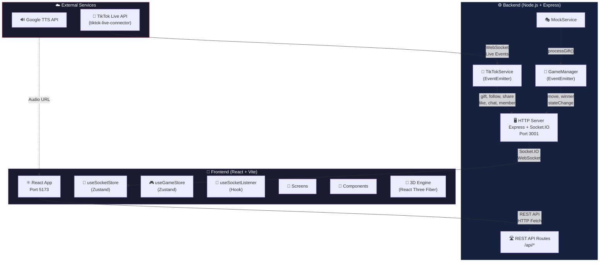
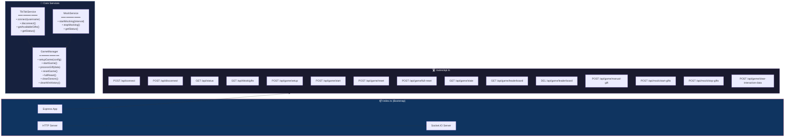
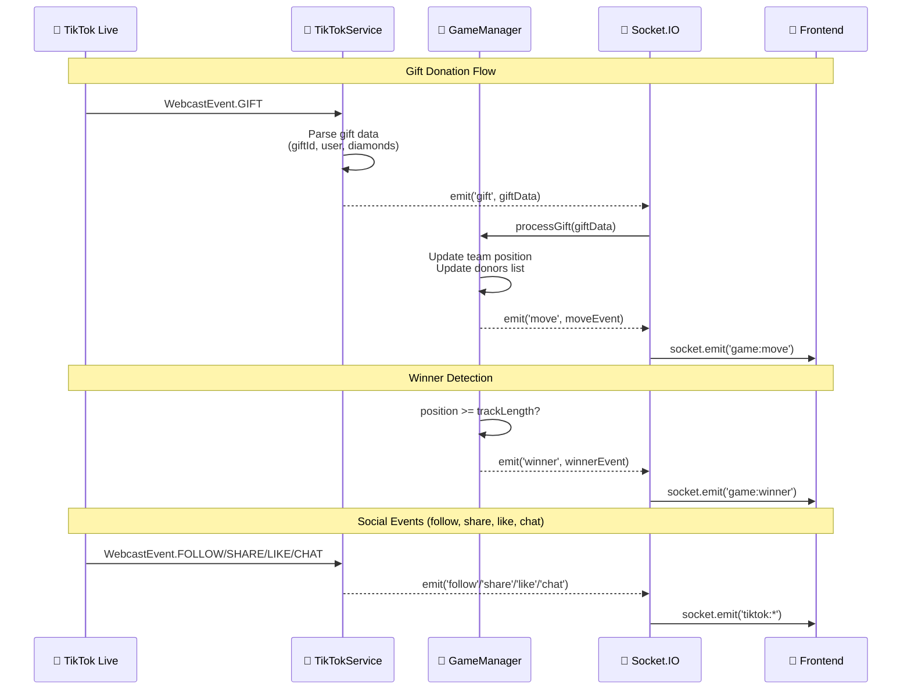
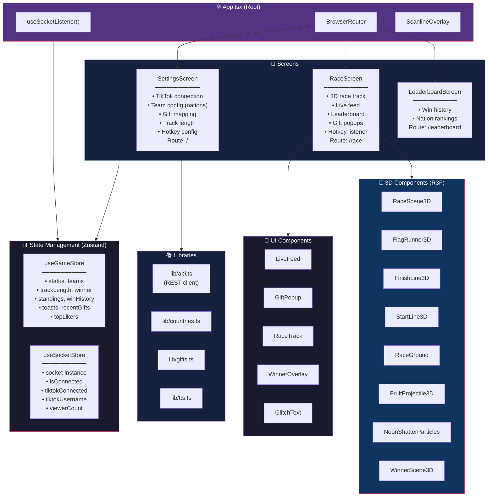
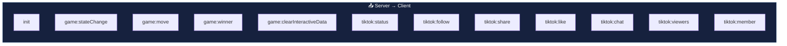
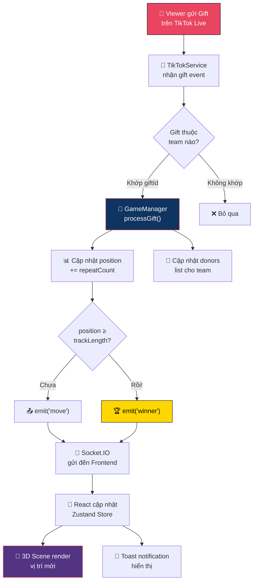
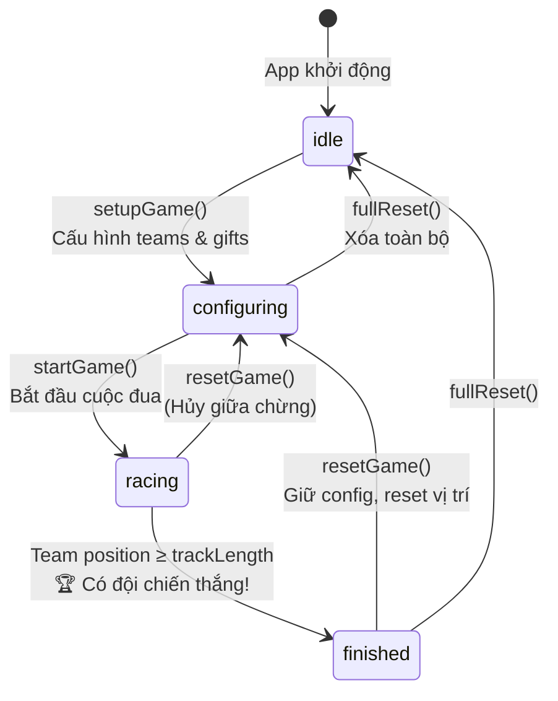

# 🏗️ System Architecture — TikTok Nation Race

## 1. Tổng quan hệ thống (High-Level Overview)



---

## 2. Backend Architecture



### Backend Event Flow (EventEmitter Pattern)



---

## 3. Frontend Architecture



---

## 4. Giao tiếp giữa Frontend & Backend

### 4.1 REST API (HTTP)

| Method | Endpoint | Mô tả |
|--------|----------|--------|
| `POST` | `/api/connect` | Kết nối TikTok Live stream |
| `POST` | `/api/disconnect` | Ngắt kết nối TikTok |
| `GET` | `/api/status` | Lấy trạng thái TikTok, Game, Mock |
| `GET` | `/api/tiktok/gifts` | Lấy danh sách gift có sẵn |
| `POST` | `/api/game/setup` | Cấu hình game (teams, trackLength) |
| `POST` | `/api/game/start` | Bắt đầu cuộc đua |
| `POST` | `/api/game/reset` | Reset vị trí, trở lại configuring |
| `POST` | `/api/game/full-reset` | Reset toàn bộ trò chơi |
| `GET` | `/api/game/state` | Lấy trạng thái game hiện tại |
| `GET` | `/api/game/leaderboard` | Lấy lịch sử chiến thắng |
| `DELETE` | `/api/game/leaderboard` | Xóa lịch sử chiến thắng |
| `POST` | `/api/game/manual-gift` | Gửi gift thủ công (hotkey) |
| `POST` | `/api/game/clear-interactive-data` | Xóa donors & likes |
| `POST` | `/api/mock/start-gifts` | Bật chế độ mock |
| `POST` | `/api/mock/stop-gifts` | Tắt chế độ mock |

### 4.2 WebSocket Events (Socket.IO)



| Event | Hướng | Payload | Mô tả |
|-------|-------|---------|--------|
| `init` | Server→Client | `GameState` | Gửi trạng thái game khi client kết nối |
| `game:stateChange` | Server→Client | `GameState` | Game state thay đổi (setup, start, reset) |
| `game:move` | Server→Client | `MoveEvent` | Đội di chuyển do nhận gift |
| `game:winner` | Server→Client | `WinnerEvent` | Có đội chiến thắng |
| `game:clearInteractiveData` | Server→Client | - | Xóa dữ liệu tương tác |
| `tiktok:status` | Server→Client | `{connected, username}` | Trạng thái kết nối TikTok |
| `tiktok:follow` | Server→Client | `TikTokUserEvent` | Có người follow |
| `tiktok:share` | Server→Client | `TikTokUserEvent` | Có người share |
| `tiktok:like` | Server→Client | `TikTokUserEvent` | Có người like |
| `tiktok:chat` | Server→Client | `TikTokUserEvent` | Tin nhắn chat |
| `tiktok:viewers` | Server→Client | `{viewerCount}` | Cập nhật số viewers |

---

## 5. Data Flow — Luồng xử lý chính



---

## 6. Game State Machine



---

## 7. Tech Stack Summary

| Layer | Công nghệ | Phiên bản |
|-------|-----------|-----------|
| **Runtime** | Node.js | - |
| **Backend Framework** | Express | 5.1.0 |
| **Realtime** | Socket.IO | 4.8.x |
| **TikTok Integration** | tiktok-live-connector | 2.1.1-beta1 |
| **Frontend Framework** | React | 19.2.x |
| **Build Tool** | Vite | 8.0.x |
| **Styling** | TailwindCSS | 4.2.x |
| **State Management** | Zustand | 5.0.x |
| **3D Rendering** | Three.js + React Three Fiber | 0.183.x |
| **Animation** | Framer Motion + GSAP | 12.x / 3.14.x |
| **Routing** | React Router DOM | 7.14.x |
| **Language** | TypeScript | 5.9.x |
| **Icons** | Lucide React + flag-icons | - |
| **TTS** | google-tts-api | 2.0.2 |
| **Language Detection** | franc-min | 6.2.0 |
| **Notifications** | Sonner | 2.0.7 |

---

## 8. Cấu trúc thư mục

```
TikTok-Interactive-Game/
├── Backend/
│   ├── src/
│   │   ├── index.ts              # Server bootstrap (Express + Socket.IO)
│   │   ├── TikTokService.ts      # TikTok Live stream connector
│   │   ├── GameManager.ts        # Game logic & state machine
│   │   ├── MockService.ts        # Fake gift generator for testing
│   │   └── routes/
│   │       └── api.ts            # REST API endpoints
│   ├── package.json
│   └── tsconfig.json
│
└── Frontend/
    ├── src/
    │   ├── main.tsx              # Vite entry point
    │   ├── App.tsx               # Root component + routing
    │   ├── index.css             # Global styles (cyberpunk theme)
    │   ├── screens/
    │   │   ├── SettingsScreen.tsx # Config UI (TikTok, teams, gifts)
    │   │   ├── RaceScreen.tsx    # Main race view + 3D
    │   │   └── LeaderboardScreen.tsx # Win history
    │   ├── components/
    │   │   ├── LiveFeed.tsx      # Real-time event feed
    │   │   ├── GiftPopup.tsx     # Gift notification popup
    │   │   ├── RaceTrack.tsx     # 2D race progress bars
    │   │   ├── WinnerOverlay.tsx # Winner celebration overlay
    │   │   ├── GlitchText.tsx   # Cyberpunk text effect
    │   │   ├── ScanlineOverlay.tsx # CRT scanline effect
    │   │   └── 3d/
    │   │       ├── RaceScene3D.tsx       # Main 3D scene
    │   │       ├── FlagRunner3D.tsx      # Animated flag runners
    │   │       ├── FinishLine3D.tsx      # 3D finish line
    │   │       ├── StartLine3D.tsx       # 3D start line
    │   │       ├── RaceGround.tsx        # 3D ground/track
    │   │       ├── FruitProjectile3D.tsx # Gift → flag animation
    │   │       ├── NeonShatterParticles.tsx # Impact particles
    │   │       └── WinnerScene3D.tsx     # 3D winner celebration
    │   ├── stores/
    │   │   ├── useGameStore.ts   # Zustand: game state
    │   │   └── useSocketStore.ts # Zustand: socket connection
    │   ├── hooks/
    │   │   └── useSocketListener.ts # Socket event → store bridge
    │   ├── lib/
    │   │   ├── api.ts            # REST API client (fetch)
    │   │   ├── countries.ts      # Country/nation definitions
    │   │   ├── gifts.ts          # Gift presets
    │   │   └── tts.ts            # Text-to-Speech utility
    │   ├── types/
    │   │   └── index.ts          # Shared TypeScript interfaces
    │   └── assets/               # Static assets
    ├── public/                   # Public static files
    ├── package.json
    └── vite.config.ts
```
